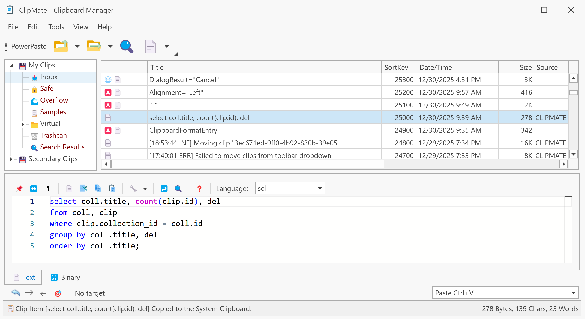

# ClipMate

A modern recreation of the classic ClipMate clipboard manager built with .NET 9 and WPF.

> This project is a modern, open‑source tribute to the original ClipMate® by
> Thornsoft Development, which I have used and appreciated since 2004.

> ⚠️ **Alpha Software** - This is an early alpha release under active development. Many features are incomplete and bugs are expected. Please report issues and help with testing!

## Status

**Current Progress: ~92% Feature Complete**

### ✅ Implemented (92%)
- Clipboard capture and monitoring (text, images, RTF, HTML, files)
- Multi-database support with collections and folders
- Search with saved queries and SQL support
- QuickPaste with auto-targeting and formatting strings
- PowerPaste automation with macro execution
- Templates with tag replacement (#DATE#, #TIME#, #SEQUENCE#, etc.)
- Macro execution with security validation and Windows SendInput API
- Shortcuts (nicknames) for quick clip access
- Import/Export (XML and flat-file formats)
- Application profiles for capture filtering
- Diagnostic tools (SQL console, event log, clipboard diagnostics, paste trace)
- Floating clip viewer with auto-follow functionality
- Text editing and transformation (case conversion, cleanup, line break removal)
- 6-format clip viewer (Text, HTML, RTF, Bitmap, Picture, Binary)
- Update checker with GitHub API integration
- Documentation site with 50+ pages (tutorials, UI, options, advanced features)
- Database maintenance (backup, restore, repair, cleanup)
- Multi-selection operations (copy/move/delete multiple clips)
- Undo system for clip operations

### 🚧 Remaining
- **Encryption** - AES-256 encryption with legacy ARC4 decrypt support
- **Printing** - DevExpress print system integration with print preview and report layouts
- **Minor UI Commands** - ~20 low-priority utility commands (Strip Non-TEXT formats, Unicode to ANSI, etc.)

### 🧪 Needs Testing
- Cross-database operations (copy/move clips between databases)
- Large database performance (1000+ clips)
- Edge cases in clipboard format handling
- QuickPaste with various target applications
- Macro execution across different application types

### 📚 Documentation Status (~80% Complete)

**Live Site**: [https://jeremy.browns.info/ClipMate/](https://jeremy.browns.info/ClipMate/)

**Completed**:
- 50+ documentation pages written
- 7 comprehensive tutorial lessons (basic operation → shortcuts)
- Complete UI reference (ClipMate Classic/Explorer, ClipList, ClipViewer, toolbars)
- All 11 options tabs documented
- Advanced features (templates, macros, search, data management)
- Glossary with terminology definitions
- GitHub Pages deployment with automatic builds

**Remaining Work**:
- Screenshots and images for visual guides
- Final accuracy review against current implementation
- Missing feature documentation (encryption, printing - when implemented)
- Video tutorials or animated GIFs for key workflows

## Prerequisites

- [.NET 9 SDK](https://dotnet.microsoft.com/download/dotnet/9.0) or later
- Windows 10 (1809+) or Windows 11
- Visual Studio 2026+ or VS Code with C# Dev Kit (for development)

## Third-Party Software

ClipMate uses the following open-source and commercial libraries:

**Vendored Libraries** (embedded in source):
- **Emoji.Wpf 0.3.4** - Emoji rendering (WTFPL license)
- **Typography** - OpenType font parsing (MIT + various permissive licenses)
- **UnicodeEmoji** - Unicode emoji data (Unicode Inc. terms)
- **WpfHexaEditor v2.1.7** - Binary hex editing (Apache 2.0)
- **Icons8** - Application icons (Icons8 license)

**Key Dependencies**:
- **DevExpress WPF 25.2.3** - UI controls and theming (**Commercial license required**)
- **Monaco Editor 0.52.0** - Code/text editing via WebView2 (MIT)
- **CommunityToolkit.Mvvm 8.4.0** - MVVM infrastructure (MIT)
- **Entity Framework Core 9.0** - Data access (MIT)
- **Serilog 4.3.0** - Structured logging (Apache 2.0)
- **Dapper 2.1.66** - Micro-ORM (Apache 2.0)
- **Tomlyn.Signed 0.19.0** - TOML parsing (BSD-2-Clause)
- **NAudio 2.2.1** - Sound playback (MIT)
- **ThrottleDebounce 2.0.1** - Debouncing for auto-save operations (Apache 2.0)
- **TUnit 1.5.80** - Testing framework (MIT)

**Build Tools**:
- **Cake Build 5.0.0** - Build automation (MIT)
- **nanoemoji** - Color font generation (Apache 2.0)
- **fonttools** - Font manipulation library (MIT)
- **Ninja** - Build system (Apache 2.0)

**Complete Attribution**: See [THIRD-PARTY-NOTICES.md](THIRD-PARTY-NOTICES.md) for full license texts and attribution details.

**DevExpress Notice**: This application requires a commercial DevExpress license for production use, modification, or redistribution. The MIT license of ClipMate's source code does not extend to DevExpress components. See [THIRD-PARTY-NOTICES.md](THIRD-PARTY-NOTICES.md) for details.

## License

This project is licensed under the MIT License - see the [LICENSE](LICENSE) file for details.

**Third-Party Components**: This project uses third-party libraries with various open-source licenses (MIT, Apache 2.0, BSD, WTFPL) and one commercial component (DevExpress). See [THIRD-PARTY-NOTICES.md](THIRD-PARTY-NOTICES.md) for complete license information and attribution.

---
## Acknowledgment

ClipMate (this project) is an independent, open‑source recreation inspired by the original **ClipMate® Clipboard Extender**, created by **Thornsoft Development, Inc.** and developed by Chris Thornton.

I have been a licensed ClipMate user since 2004, and this project was created as a tribute to the original application and the impact it had on my daily workflow. This project is not affiliated with, endorsed by, or connected to Thornsoft
Development in any way. All trademarks and copyrights for the original ClipMate® belong to their respective owners.

---

**Built with .NET 9, WPF, and DevExpress**  
*A modern recreation of the classic ClipMate clipboard manager*

Status: **Alpha** | Version: 0.1.0 | Last Updated: January 9, 2026
