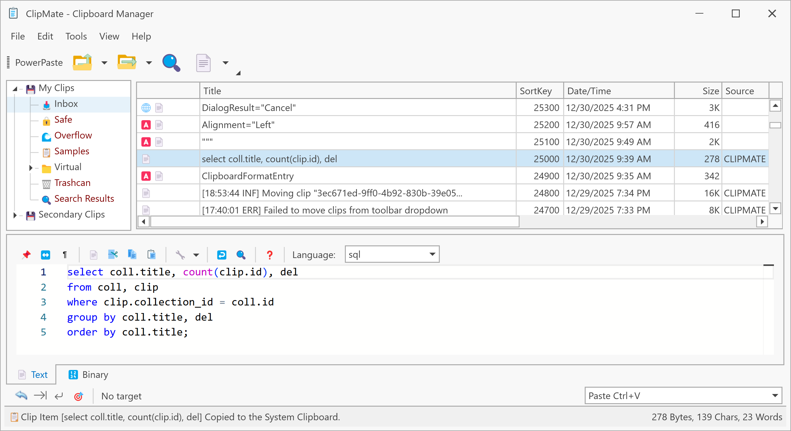

# ClipMate

A modern recreation of the classic ClipMate clipboard manager built with .NET 10 and WPF.

> This project is a modern, open‑source tribute to the original [ClipMate](http://www.clipmate.com/clipmate7.htm)® by
> [Thornsoft Development](http://www.thornsoft.com/), which I have used and appreciated since 2004.

> 🧪 **Beta Software** - ClipMate has reached feature parity with the original ClipMate and is now in beta testing. While all major features are implemented, you may encounter bugs as we focus on stability and polish. Please report any issues you find!

## Download

## Status

ClipMate has reached **99% feature parity** with the original ClipMate 7.5 and is now in **beta testing**. All core functionality is implemented and stable, with focus now on polish, performance, and bug fixes.

### Key Features
- **Clipboard Management** - Capture and organize text, images, RTF, HTML, and files with multi-format support
- **QuickPaste & PowerPaste** - Smart auto-targeting paste and macro automation for workflow efficiency
- **Organization** - Multi-database support with collections, folders, and virtual (SQL-based) collections
- **Search & Discovery** - Full-text search, saved queries, and SQL console for advanced filtering
- **Templates & Shortcuts** - Reusable content with tag replacement and nickname-based quick access
- **Text Editing** - Monaco editor integration with syntax highlighting, transformations
- **Encryption** - AES-256 protection with session-based key management and automatic cleanup
- **Printing** - Customizable reports with print preview and layout options
- **Diagnostics** - SQL console, event log, clipboard diagnostics, and paste trace tools
- **Import/Export** - XML and flat-file formats for backup and data migration

For complete feature documentation, see the [documentation site](https://jeremy.browns.info/ClipMate/).

### 🧪 Beta Testing Focus
- Cross-database operations (copy/move clips between databases)
- Large database performance (1000+ clips)
- Edge cases in clipboard format handling (RTF, HTML, File formats)
- QuickPaste with various target applications
- Macro execution across different application types

### 📚 Documentation Status (~80% Complete)

**Live Site**: [https://jeremy.browns.info/ClipMate/](https://jeremy.browns.info/ClipMate/)

**Remaining Work**:
- Screenshots and images for visual guides
- Final accuracy review against current implementation
- Missing feature documentation (encryption, printing)
- Video tutorials or animated GIFs for key workflows

## Prerequisites

- [.NET 10 SDK](https://dotnet.microsoft.com/download/dotnet/10.0) or later
- Windows 10 (1809+) or Windows 11
- Visual Studio 2026+ or VS Code with C# Dev Kit (for development)

## Third-Party Software

ClipMate uses the following open-source and commercial libraries:

**Vendored Libraries** (embedded in source):
- **Emoji.Wpf 0.3.4** - Emoji rendering (WTFPL license)
- **Typography** - OpenType font parsing (MIT + various permissive licenses)
- **UnicodeEmoji** - Unicode emoji data (Unicode Inc. terms)
- **WpfHexaEditor v2.1.7** - Binary hex editing (Apache 2.0)
- **Icons8** - Application icons (Icons8 license)

**Key Dependencies**:
- **DevExpress WPF 25.2.3** - UI controls and theming (**Commercial license required**)
- **Monaco Editor 0.52.0** - Code/text editing via WebView2 (MIT)
- **CommunityToolkit.Mvvm 8.4.0** - MVVM infrastructure (MIT)
- **Entity Framework Core 10.0** - Data access (MIT)
- **Serilog 4.3.0** - Structured logging (Apache 2.0)
- **Dapper 2.1.66** - Micro-ORM (Apache 2.0)
- **Tomlyn.Signed 0.20.0** - TOML parsing (BSD-2-Clause)
- **NAudio 2.2.1** - Sound playback (MIT)
- **ThrottleDebounce 2.0.1** - Debouncing for auto-save operations (Apache 2.0)
- **TUnit 1.12.43** - Testing framework (MIT)

**Build Tools**:
- **Cake Build 5.0.0** - Build automation (MIT)
- **nanoemoji** - Color font generation (Apache 2.0)
- **fonttools** - Font manipulation library (MIT)
- **Ninja** - Build system (Apache 2.0)

**Complete Attribution**: See [THIRD-PARTY-NOTICES.md](THIRD-PARTY-NOTICES.md) for full license texts and attribution details.

**DevExpress Notice**: This application requires a commercial DevExpress license for production use, modification, or redistribution. The MIT license of ClipMate's source code does not extend to DevExpress components. See [THIRD-PARTY-NOTICES.md](THIRD-PARTY-NOTICES.md) for details.

## License

This project is licensed under the MIT License - see the [LICENSE](LICENSE) file for details.

**Third-Party Components**: This project uses third-party libraries with various open-source licenses (MIT, Apache 2.0, BSD, WTFPL) and one commercial component (DevExpress). See [THIRD-PARTY-NOTICES.md](THIRD-PARTY-NOTICES.md) for complete license information and attribution.

---
## Acknowledgment

ClipMate (this project) is an independent, open‑source recreation inspired by the original **ClipMate® Clipboard Extender**, created by **Thornsoft Development, Inc.** and developed by Chris Thornton.

I have been a licensed ClipMate user since 2004, and this project was created as a tribute to the original application and the impact it had on my daily workflow. This project is not affiliated with, endorsed by, or connected to Thornsoft
Development in any way. All trademarks and copyrights for the original ClipMate® belong to their respective owners.

---

**Built with .NET 10, WPF, and DevExpress**  
*A modern recreation of the classic ClipMate clipboard manager*

Status: **Beta** | Version: 0.1.0 | Last Updated: January 26, 2026
