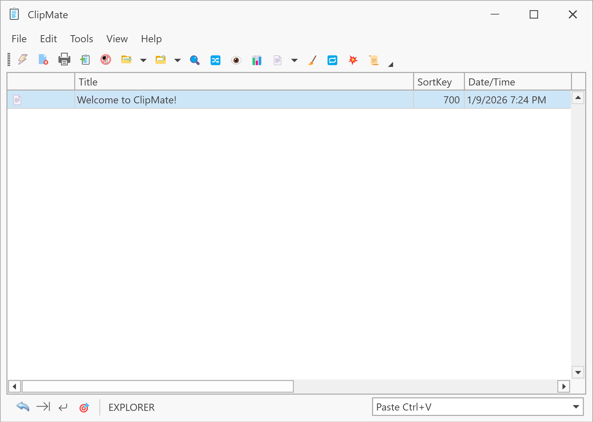

# ClipMate Classic

ClipMate Classic closely resembles previous versions of ClipMate and takes up much less screen space than ClipMate Explorer. It features a menu, a toolbar, and a drop-down list of clips (the ClipList).

## Window States

ClipMate Classic has two states:

### Rolled-Up State
In this compact state, Classic shows just the toolbar and a single-line display of the current clip. This is ideal for keeping ClipMate accessible without consuming screen space.

### Dropped-Down State
Click the drop-down arrow in the lower-right corner, and the window expands to show:
- The **ClipList** with all clips in the current collection
- A **Preview/Edit** pane showing the selected clip's contents
- The **QuickPaste toolbar** at the bottom

## Key Features

- **Immediate Clipboard Loading**: As soon as you select a clip in the ClipList, it's placed onto the system clipboard, ready for pasting into any application.

- **Tack Button**: When dropped-down, a "tack" button appears next to the drop-down button. Click it to keep Classic in the dropped-down state. Otherwise, it automatically rolls up when you switch to another application.

- **QuickPaste Toolbar**: The bottom toolbar shows the current QuickPaste target application.

- **Space-Saving Editor**: The preview/edit window hides its toolbar by default to save space. Right-click within the editor to access toolbar options or show the full toolbar.

## Navigation

| Action | Method |
|--------|--------|
| Toggle drop-down state | Press **Spacebar** or click the drop-down button |
| Switch to Explorer | Press **Ctrl+E** or click the Switch button |
| Stay on top / Auto-hide | Use **View → Visibility** menu or the titlebar visibility button |

## Accessing ClipMate Classic

If you're in Explorer:
- Click the **Switch Between Classic/Explorer** button
- Press **Ctrl+E**
- Use **View → Open ClipMate Classic** menu

If Classic is already loaded but hidden, it appears instantly. Otherwise, there's a slight delay while the window loads. You can opt to pre-load Classic at startup in the Visual tab of the Options dialog.

## QuickPaste and Classic

QuickPaste functionality is now available in any ClipList, including Explorer. ClipMate Classic no longer has a specific "QuickPaste mode" as in earlier versions.

For convenience, the old QuickPaste Hotkey (**Ctrl+Shift+Q**) still brings up Classic in dropped-down mode.

## See Also

- [ClipMate Explorer](clipmate-explorer.md)
- [QuickPaste Options](../options/quickpaste.md)
