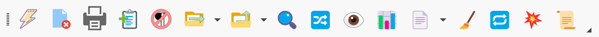

# Main Toolbar Buttons

The ClipMate toolbar provides quick access to frequently-used operations. The same toolbar buttons are available across ClipMate Explorer and ClipMate Classic. You can customize which buttons appear on any toolbar.

## Customizing Toolbars

To customize a toolbar:
1. Right-click on a button or blank space in the toolbar
2. Select **Customize** from the menu
3. In the customization dialog, add or remove buttons as needed
4. Choose between large and small button sets

## Available Buttons

| Button | Function | Description |
|--------|----------|-------------|
| &#xE008; [PowerPaste](powerpaste.md) | Batch Pasting | Paste a series of clips automatically |
| &#xE004; [Delete](delete-clips.md) | Remove Clips | Delete selected clips to Trashcan |
| 🖨️ [Print](print.md) | Print Clips | Print selected clips |
| &#xE001; [Append](append.md) | Combine Clips | Glue multiple text clips together |
| &#xE00C; Remove Breaks | Text Cleanup | Remove line breaks from selected text |
| &#xE007; [Move to Collection](move-clips-to-collection.md) | Organize | Move clips to another collection |
| &#xE006; [Copy to Collection](copy-clips-to-collection.md) | Organize | Copy clips to another collection |
| 📁 [Select Collection](select-collection.md) | Navigate | Switch to a different collection |
| 🔍 [Search](search.md) | Find Clips | Open the search dialog |
| 🔀 [Switch Classic/Explorer](switch-classic-explorer.md) | Toggle View | Switch between interface modes |
| 👁️ [View Clip](view-clip.md) | Floating Editor | Open clip in separate window |
| 🖼️ [View Mode](view-mode.md) | Change Display | Toggle Detail/Thumbnail view |
| 📊 [Outbound Filtering](outbound-clip-filtering.md) | Format Control | Filter clipboard output to plain text |
| 📄 [Templates](templates.md) | Formatted Paste | Paste clips with metadata |
| 🧹 Text Clean-up | Format Text | Clean up text formatting issues |
| 🔁 [Loop PowerPaste](powerpaste.md#looping-powerpaste) | Continuous Mode | Enable PowerPaste looping mode |
| 💥 [Explode PowerPaste](powerpaste.md#exploding-powerpaste) | Split Mode | Enable PowerPaste explode mode |
| 📜 [Event Log](event-log.md) | Diagnostics | View clipboard activity log |

## Screen Capture Buttons

| Button | Function | Description |
|--------|----------|-------------|
| Screen Capture by Area | Region Capture | Capture a selected screen region |
| Screen Capture by Desktop | Full Capture | Capture the entire desktop |
| Screen Capture by Monitor | Monitor Capture | Capture a specific monitor |

## Additional Toolbar Options

Some buttons have additional features:

- **Split Buttons**: Buttons like Move/Copy to Collection have a drop-down arrow that reveals a menu of collections. Click the icon to repeat the last action, or click the arrow to choose a different collection.

- **Toggle Buttons**: PowerPaste and Outbound Filtering show their current state with visual indicators.

## See Also

- [PowerPaste](powerpaste.md)
- [Search](search.md)
- [Visual Options](../../options/visual.md)
